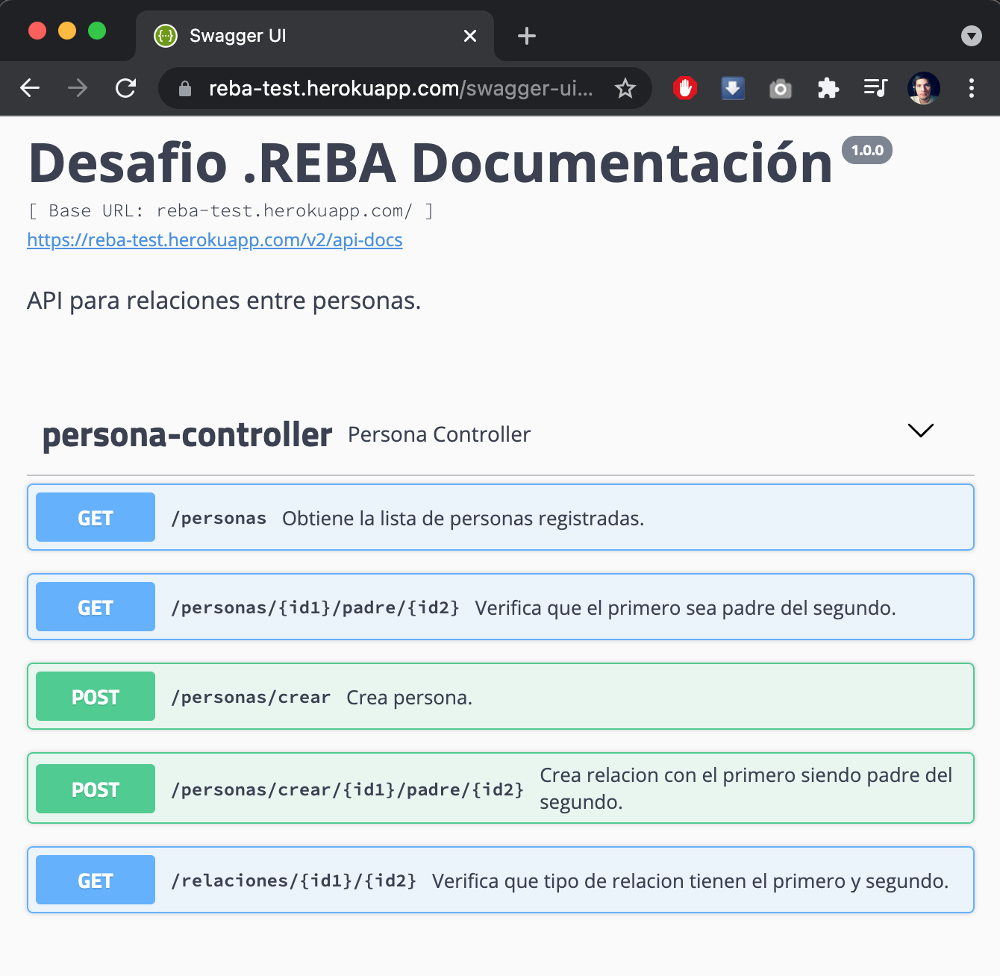
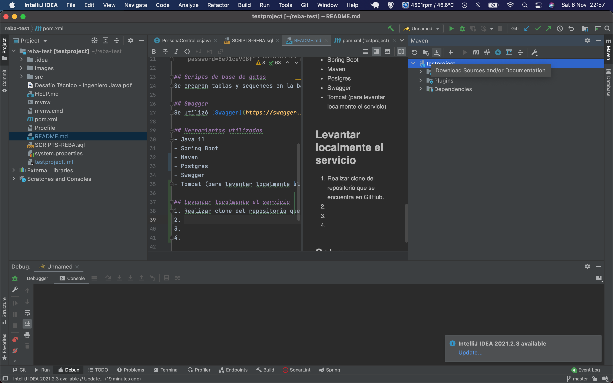
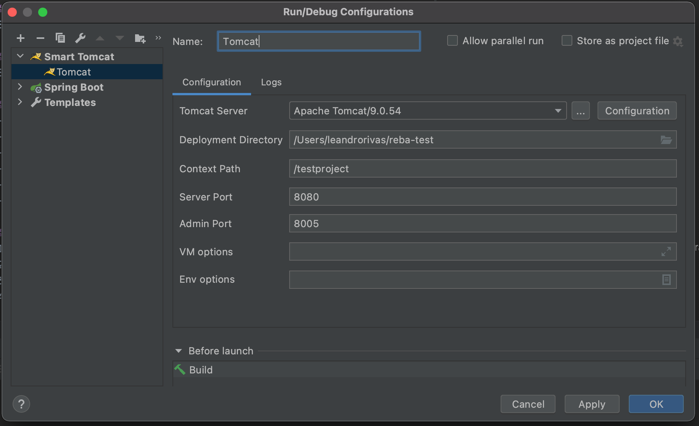
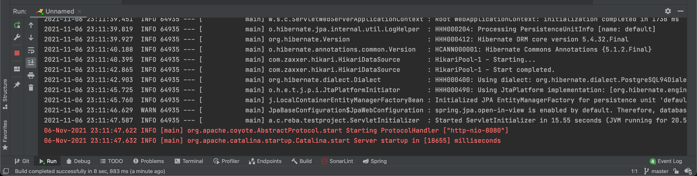
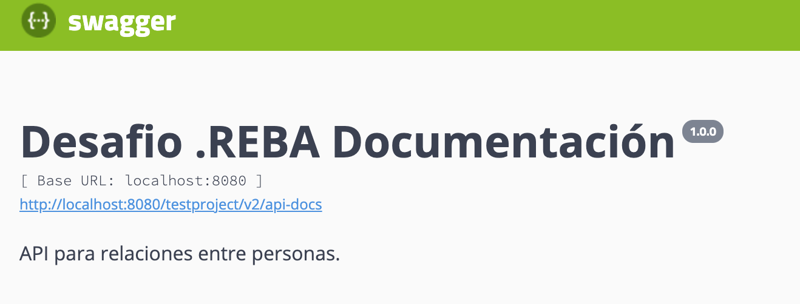

# Desafio .REBA
## Relacion entre personas

## Endpoints
- /testproject/personas
- /testproject/personas/{id1}/padre/{id2}
- /testproject/personas/crear
- /testproject/personas/crear/{id1}/padre/{id2}
- /testproject/relaciones/{id1}/{id2}

## Acceso API
Se servicio se encuentra deployado en [Heroku](https://www.heroku.com). Para acceder al mismo, hacer click [aquí](https://reba-test.herokuapp.com/swagger-ui.html).

## Base de datos Postgres
Al igual que el servicio, la base de datos tambien se encuentra en Heroku. A continuación, se lista los datos de conexión:

    url=jdbc:postgresql://ec2-54-159-244-207.compute-1.amazonaws.com:5432/d76quv0s8emjn9
    username=lhmwuijnrvotlz
    password=8e91ce908f0dc2867d0ddf3aafd1593b979c94bf23e6face3726dc1b5654ec2b

## Scripts de base de datos
Se crearon tablas y sequences en la base de datos Postgres. En el repositorio se encuentra el archivo `SCRIPTS-REBA.sql` se encuentra todos los scripts ejecutados. El archivo esta ordenado de modo que se pueda correr de inicio a fin sin errores. 

## Swagger
Se utilizó [Swagger](https://swagger.io/) para la documentación del servicio. Tambien facilita la prueba de los endpoints desarrollados.

## Herramientas utilizadas
- Java 11
- Spring Boot
- Maven
- Postgres
- Swagger
- Tomcat (para levantar localmente el servicio)
- Intellij IDEA
- DBeaver

## Levantar localmente el servicio

###Configurar servicio
1. Realizar clone del repositorio que se encuentra en GitHub.
2. Importar el proyecto en el IDE de su preferencia. En este caso se utilizo Intellij IDEA.
3. Descargar las dependencias de Maven.\
   
4. Configurar el Apache como se muestra a continuacion. Se debe apuntar a la carpeta de Apache Tomcat (previamente tuvo que haberse descargado).\
   
5. Una vez configurado el Apache, iniciarlo.\
   
6. Una vez levantado el servicio, ingresar a http://localhost:8080/testproject/swagger-ui.html \
   
7. Listo!

## Sobre
Proyecto realizado por Leandro Matias Rivas.
